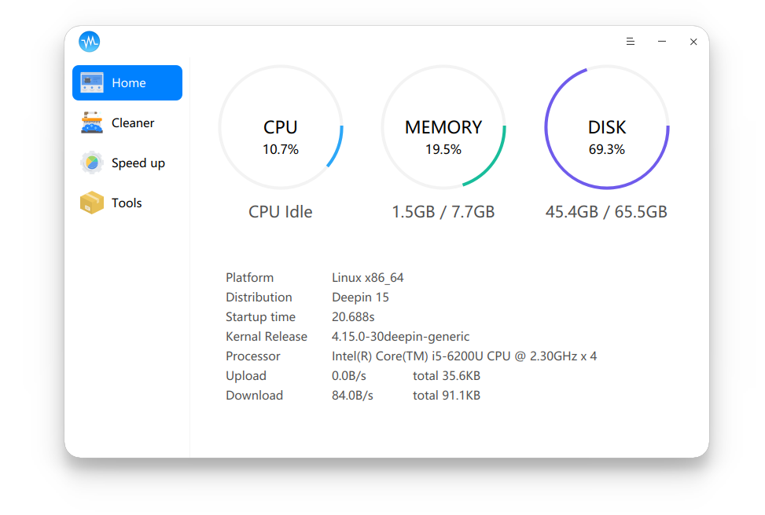

# Sysbro

A system assistant for deepin/Ubuntu18.10.

[Downloads](https://github.com/rekols/sysbro/releases)

## Dependencies

* sudo apt install g++ qt5-default qttools5-dev-tools libdtkwidget-dev

## Build

* mkdir build
* cd build
* qmake ..
* make

## Build a deb package

* dpkg-buildpackage -b

## License

sysbro is licensed under GPLv3.
